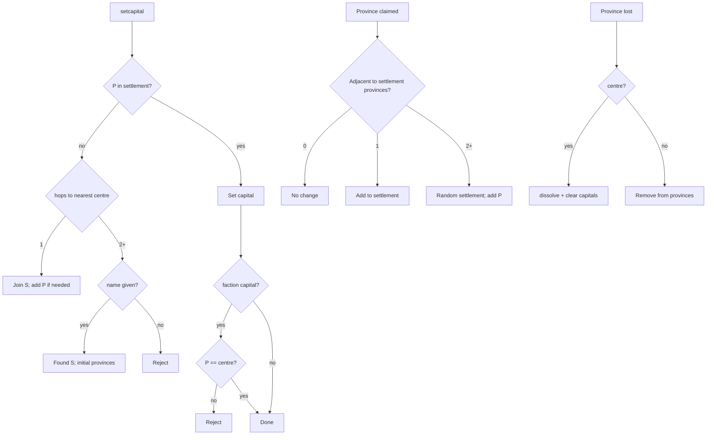

# Settlements

Settlements are **named cities** on the political map. A faction owns zero or more settlements. Each settlement has a **centre province**, a **display name**, **map coordinates** for the web marker, and an explicit **list of provinces** that belong to the city.

Guild and faction **capitals** are separate: they point at a province. Whether a capital “lives in” a city is derived — a guild counts toward a settlement’s population when its capital province is in that settlement’s province list.

This document is the product spec for implementation (step 42). Code lives under the lowercase `settlement` package; see [Package layout](#package-layout).

---

## Concepts

| Term | Meaning |
|------|---------|
| **Settlement** | A named city (`Settlement` object) with a centre, marker coords, and a fixed province list |
| **Centre province** | Province where the city was founded (`centerProvince`); faction capital must be here when using an existing city |
| **Capital (faction/guild)** | Province id stored on `Faction` / `Guild` as today — the seat of government or guild HQ |
| **Population** | All guilds in the faction (including the main/base guild) whose `capital` province is in the settlement’s `provinces` list |
| **Direct ownership** | Province is on the faction’s own `ProvinceHandler` list — not vassal land, not foreign |

Settlements from **different factions** may border each other (split cities, e.g. Buda / Pest). Province lists are **disjoint within a faction** only.

---

## Data model

### `settlement.Settlement`

| Field | Type | Notes |
|-------|------|--------|
| `id` | `String` | Auto from name via `Formatter.formatId` (same pattern as factions/guilds) |
| `name` | `String` | Display name via `Formatter.formatName` + `StringFormatter.formatHex` |
| `centerProvince` | `int` | Founding province; always in `provinces` |
| `centerX` | `int` | Block X where founder stood at founding |
| `centerZ` | `int` | Block Z where founder stood at founding |
| `provinces` | `Set<Integer>` | **Authoritative** territory; mutually exclusive across the faction |

**Invariants**

- `centerProvince ∈ provinces` while the settlement exists.
- No province appears in more than one settlement on the same faction.
- Every `p ∈ provinces` is directly owned by the faction.

### `settlement.handler.Handler` (per `Faction`)

| Responsibility | Notes |
|----------------|--------|
| `Map<String, Settlement> byId` | Lookup by settlement id |
| `Map<Integer, Settlement> provinceIndex` | Rebuilt after load and after mutations |
| CRUD + lifecycle | Found, join, dissolve, claim/loss hooks, `validate()` |

### Existing objects (minimal changes)

| Object | Change |
|--------|--------|
| `Faction` | Holds `SettlementHandler`; no `capitalName` on faction |
| `Guild` | Keeps `capital` (`int`); no settlement fields — link is derived |
| `ProvinceHandler` | Calls settlement handler on province add/remove |
| `Faction.tick()` | Calls `settlementHandler.validate()` (existing tick loop — no new scheduler) |

### Persistence (`Database`)

**`SettlementData`** (new):

```text
id, name, centerProvince, centerX, centerZ, provinces[]
```

**`FactionData`** — add:

```text
settlements: SettlementData[]
```

On load: deserialize settlements, rebuild `provinceIndex`.

Legacy factions with capitals but no settlements are **not** migrated; map markers appear only after the settlement rules run.

---

## Distance rule

Use **land province hops** on the province neighbour graph (non-water adjacency; same notion as claim adjacency).

For province `P` and settlement `S`, define:

```text
hops(P, S) = minimum land hops from P to S.centerProvince
```

| `hops(P, S)` | Meaning |
|--------------|---------|
| `0` | `P` is the centre (and is in `S.provinces` once joined/founded) |
| `1` | Adjacent to centre — **join** `S` (no new city, no name) |
| `≥ 2` | Far enough to **found** a new named settlement (if `P` is not already in any list) |

**Founding distance:** `P` may found a new settlement only when `hops(P, S) ≥ 2` for **every** settlement `S` in the faction.

Config: `settlement-found-distance` → `Cache.settlementFoundDistance` (default **2**).

---

## Commands

Player stands in the target province. Block coords are taken from the player’s location at command time for **new** settlements (marker position).

### `/faction setcapital [name]`

| Situation | Behaviour |
|-----------|-----------|
| `P` already in settlement `S` | Set faction capital to `P`. **Must** be `S.centerProvince` — reject if `P` is only an outer province |
| `P` not in any list, `hops(P, S) == 1` for some `S` | Join `S`: set capital, add `P` to `S.provinces` if missing, tell player |
| `P` not in any list, `hops(P, S) ≥ 2` for all `S` | **Require** `name` → found new settlement |
| Name omitted when required | Reject with usage message |

### `/guild setcapital [name]`

Same distance/join/found rules as guild command. **No** centre-only restriction — guild capital may be any province in the settlement (centre or outer ring).

### Tab completion

Complete settlement **`id`** strings (not display names).

### Player feedback (required)

Messages should state clearly:

- Founded: city name + id
- Joined: which settlement was joined
- Rejected: why (too close to found, faction capital not on centre, name required, etc.)
- Dissolved: city destroyed (centre lost, validate, or last guild left)

---

## Founding a new settlement

Triggered when `setcapital` requires a name (distance ≥ 2 from all centres, or first city on the faction).

1. Create `Settlement` with `id`, `name`, `centerProvince = P`, `centerX/Z` from player.
2. Build **initial** `provinces`:
   - Start with `{ P }`.
   - For each **land** neighbour `n` of `P`:
     - Faction directly owns `n`
     - `n` is not sea/water
     - `n` is not already in another settlement’s list  
     → add `n`.
3. Register in handler + province index.
4. Set guild or faction capital to `P`.

Borders are **decided at create** for all owned eligible neighbours. They are not recomputed dynamically later (avoids overlap ambiguity).

---

## Joining an existing settlement (`setcapital`, no name)

When `P` is **not** in any settlement list but `hops(P, S) == 1` for exactly one logical match (nearest centre rule — if multiple settlements have centre 1 hop away, lock tie-break: nearest centre hops, then stable id order):

1. Set capital to `P`.
2. If `P ∉ S.provinces`, **add `P`** to `S.provinces`.

**Why add `P`?** Capital points at a province that must belong to the city for population lookup and map consistency. Example: Rivendell centre `100`, provinces `{100,101,102}`; player sets capital on `103` one hop from `100` but `103` was never in the list → join Rivendell **and** add `103`.

**Faction:** capital may only be set on join when `P == S.centerProvince`. If join case would be outer ring only, reject for faction (guild may use outer ring).

---

## Territory growth (province claim)

When the faction **claims** province `P` (hook from `ProvinceHandler` / claim flow):

1. If `P` is already in some settlement’s list → no change.
2. Find all settlements where `P` is land-adjacent to **at least one** province in that settlement’s list, faction directly owns `P`, and `P` is not water.
3. **0 candidates** → no change.
4. **1 candidate** → add `P` to that settlement’s `provinces`.
5. **2+ candidates** → **random** choice among candidates, add `P` to the chosen settlement.

Coin flip applies to **claims only**, not to `setcapital` join.

---

## Territory loss

When the faction **loses** province `P`:

| Case | Action |
|------|--------|
| `P` is not in any settlement | No change |
| `P` is in settlement `S`, `P ≠ S.centerProvince` | Remove `P` from `S.provinces` |
| `P == S.centerProvince` | **Dissolve** `S` entirely |

---

## Dissolve settlement

Call when centre is lost, validate removes centre, settlement is empty, or [relocate disband](#guild-relocate) applies.

1. For **every** guild in the faction (including base): if `guild.capital ∈ S.provinces` → clear capital (`-1`).
2. If `faction.capital ∈ S.provinces` → clear faction capital.
3. Remove `S` from handler and province index.
4. Notify relevant players / enqueue map update as needed.

---

## `validate()` (main tick)

Runs from **`Faction.tick()`** inside the existing `FactionManager` tick cycle — **no** separate scheduler.

Each tick (or throttled inside the handler if needed):

```
for each settlement S:
  remove any p in S.provinces where faction does not directly own p
  if S.provinces is empty
     OR S.centerProvince not in S.provinces
     OR faction does not directly own S.centerProvince:
    dissolve(S)
rebuild provinceIndex
```

Event hooks handle normal claim/loss; `validate()` is the safety net for desync.

---

## Guild relocate

When a guild **relocates** to another faction (`Guild.relocate`) and capital changes:

**Old faction**

1. Let `S` = settlement containing the guild’s **old** capital (if any).
2. After capital moves, if **no** guild in that faction still has `capital ∈ S.provinces` → **dissolve** `S` (last guild left the city).

**New faction**

Apply the same rules as `setcapital` at `newCapital`:

- Province in existing settlement → set capital (guild: any province in city).
- 1 hop from a centre → join + add province if needed.
- ≥ 2 hops → require a **name** and found new settlement (relocation flow must supply name when needed).

There is **no** rename command. Moving is relocate + settlement rules at the destination.

---

## Population

Not stored. Computed:

```text
population(S) = { guild g in faction | g.capital ∈ S.provinces }
```

Includes the main/base guild. Used for UI, future chronicle, etc. Map v1 markers are per settlement, not per guild.

---

## Map export

Export each settlement for ProvinceSystem (`map_markers` sidecar or equivalent):

| Field | Source |
|-------|--------|
| `id` | `settlement.id` |
| `name` | `settlement.name` |
| `faction_id` | owning faction |
| `province_id` | `centerProvince` |
| Marker position | `centerX`, `centerZ` (PS converts to map pixels) |
| `kind` | `faction_capital` if `faction.capital == centerProvince`; else `settlement` |

Guild seats in the same city do not get separate markers in v1.

---

## Package layout

New code uses **lowercase** packages (same convention as `government`, `laws`, `Guild.income`):

```text
settlement/
  Settlement.java
  handler/
    Handler.java
    CapitalResult.java   # optional: outcome of setcapital resolution
```

Touch legacy packages only at thin integration points: `Faction`, `ProvinceHandler`, `CommandManager`, `Database`, `Map.export`.

---

## Flow summary



---

## Related planning

- ProvinceSystem step 42: [map-export-schema.json](https://github.com/Drefvelin/ProvinceSystem/blob/main/ProvinceSystem/Planning/assets/map-export-schema.json)
- Playbook requirement 8: named capitals / settlements on map

When this spec changes, update `ProvinceSystem/Planning/batches/step-42/01-planning-lock.md` to match.
