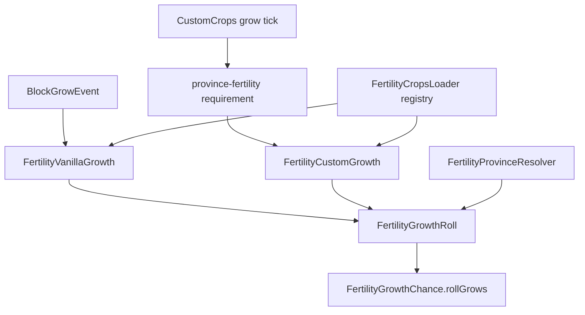

# Province fertility crop growth

**Shipped.** Each province has a fertility score (0-100). On every crop growth attempt, SimpleFactions looks up fertility at the block location, applies a per-crop **weight**, rolls against a power curve, and either allows or blocks that growth tick.

**Province grid:** [province-grid.md](./province-grid.md) · **Map fertility layer:** [ProvinceSystem map overview](../../ProvinceSystem/docs/map/overview.md)

---

## Formula

```
growChance = (fertility / 100) ^ weight
```

On each growth attempt: `random < growChance` allows growth.

| Fertility | Result |
|-----------|--------|
| `0` | Never grows |
| `100` | Always grows |
| `1-99` | Rolled per attempt |

**Weight** is in `(0, 1]`. Higher weight means fertility matters more. Wheat at `0.90` is heavily gated by land quality; potato at `0.30` tolerates poor soil.

Example at fertility 50:

| Crop | Weight | Chance |
|------|--------|--------|
| Wheat | 0.90 | ~53% |
| Potato | 0.30 | ~78% |

---

## When it runs



---

## Activation gates

| Condition | Behavior |
|-----------|----------|
| `fertility-crops.yml` `enabled: false` | Feature off; all crops grow normally |
| `Cache.provincesEnabled` or `Cache.mapEnabled` false | Province lookup inactive; all crops grow normally |
| Crop not listed in yaml | Not governed; growth always allowed |
| Unmapped / invalid province id | Fertility treated as **0** (resolver returns 0; not a config key) |

---

## Config

File: `plugins/SimpleFactions/fertility-crops.yml` (shipped default in `src/main/resources/`).

| Key | Meaning |
|-----|---------|
| `enabled` | Master switch |
| `vanilla:` | Bukkit `Material` name to weight |
| `customcrops:` | CustomCrops crop config id to weight (e.g. `nutmeg`, not seed item ids) |

Loaded by `FertilityCropsLoader` from `loadConfigs()`. Invalid material names or weights outside `(0, 1]` fail startup.

Weights are **not** in `config.yml` or `Cache`.

---

## Excluded crops

Intentionally absent from yaml; never governed by fertility:

`CAVE_VINES`, `CAVE_VINES_PLANT`, `CACTUS`, `BAMBOO`, `BAMBOO_SAPLING`, `KELP`, `KELP_PLANT`, `CHORUS_FLOWER`, `CHORUS_PLANT`, `BROWN_MUSHROOM`, `RED_MUSHROOM`

---

## Vanilla path

`FertilityCropGrowthListener` listens to `BlockGrowEvent` at `NORMAL` priority. Failed rolls cancel silently (no player message).

Bone meal is **not** handled here. tfmccore owns bone meal bypass logic.

Stem crops: both `MELON_STEM` / `ATTACHED_MELON_STEM` and `PUMPKIN_STEM` / `ATTACHED_PUMPKIN_STEM` are listed in yaml so either stem type is covered.

---

## CustomCrops path

Soft dependency on CustomCrops. SimpleFactions registers a grow requirement; server ops add it to each crop's `grow-conditions` on the live CustomCrops install (not in the SF repo).

**Requirement types:** `province-fertility` (alias `simplefactions-fertility`)

```yaml
sf_fertility:
  type: province-fertility
```

Optional per-condition weight override (beats `fertility-crops.yml` for that condition only):

```yaml
sf_fertility:
  type: province-fertility
  value: 0.75
```

`CustomCropsFertilityBridge` registers after `loadConfigs()`, re-registers on `CustomCropsReloadEvent`, and handles late `PluginEnableEvent` if CustomCrops loads after SimpleFactions.

Crop ids in yaml must match CustomCrops crop config keys (`tomato`, `rice`, `nutmeg`, ...).

---

## Fertility data source

Per-province fertility comes from `provinces.txt` field 3:

```
id = R,G,B;terrain;fertility
```

Mapgen writes the fertility layer; the web map viewer fertility mode reads the same source. See [ProvinceSystem title-editor](../../ProvinceSystem/docs/map/title-editor.md).

At runtime, `FertilityProvinceResolver` uses `ProvinceGrid.getAt(x, z)` then `ProvinceManager.get(id).getFertility()`.

---

## Class map

| Class | Role |
|-------|------|
| `Map/fertility/FertilityGrowthChance` | Pure math and `rollGrows` |
| `Map/fertility/FertilityGrowthRoll` | Shared allow/deny roll |
| `Map/fertility/FertilityVanillaGrowth` | Material lookup + cancel decision |
| `Map/fertility/FertilityCustomGrowth` | Custom crop id lookup + weight override |
| `Map/fertility/FertilityProvinceResolver` | Grid + `ProvinceManager` fertility |
| `Map/fertility/FertilityCropRegistry` | Immutable weight maps |
| `Map/fertility/FertilityCropGrowthListener` | `BlockGrowEvent` listener |
| `Map/fertility/customcrops/*` | CustomCrops requirement bridge only |
| `Loaders/FertilityCropsLoader` | Yaml loader |

---

## Tests

```bash
cd simplefactions && mvn test -Dtest="me.Plugins.SimpleFactions.Map.fertility.**,me.Plugins.SimpleFactions.Loaders.FertilityCropsLoaderTest"
```

---

## Manual smoke

Full in-game matrix: [fertility-verify.md](./fertility-verify.md).

Quick checks:

1. **Fertility 100 province** - wheat, tomato, nether wart grow at normal speed.
2. **Fertility 0 province** - same crops never advance a stage.
3. **Fertility ~40 province** - potato/onion/olive outperform wheat/rice/tomato over several minutes.
4. **CustomCrops** - crop with `province-fertility` in grow-conditions respects the same curve.
5. **`/customcrops reload`** - requirement stays registered (growth behavior unchanged).
