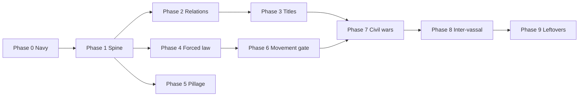

# War goals: phase plan

**Gameplay lock:** [00-index.md](./00-index.md)  
**Canonical spec:** [wars.md](../../wars.md)  
**Status:** Phase 0 done. Phases 1-6 are the war-goal apply program. Phases 7+ are later systems; spec those when we start them.

This is the **implementation sequence**. Batches inside a phase can ship as separate PRs. Do not start the next phase until the current phase's exit criteria are met. Do not add a second diplomacy, law, tax, or government engine.

---

## Why this order

1. **Spine before goals.** Forced `setRelation` and a single war-end applicator must exist before any goal writes politics. Otherwise every goal invents its own end hook.
2. **External wars before same-realm cracks.** Tributary / subjugate / transfer only need independent (or tributary) targets. Usurp and later civil/inter-vassal work punch holes in `sameRealm`. Finish the simple declare surface first.
3. **Call existing engines before rewriting GUIs.** Relation apply and `FactionManager.usurp` are thin. De jure eligibility is a rewrite. Open market / change government are `applyLaw` plus YAML. Pillage is a different campaign shape. Movement goals need a shared apply gate that peace-time cave-in also uses.
4. **Law-on-target wars do not wait for movements.** Open market and change government are player-declared wars. Overthrow / change law / change tax are movement-origin. Split them so the movement gate is not on the critical path for diplomatic and law wars.
5. **Staff `War` is a no-op on the spine.** It lets you test end reasons without applying a goal. `Revolt` waits for civil wars.
6. **Civil wars, inter-vassal wars, and full movements** share realm/relation problems. They come last and get their own lock when we reach them.

Phases 4 and 5 can run after Phase 1 without waiting for titles. Prefer **2 then 3 then 4 then 5** in one line of work so declare GUI and apply stay one story. Only parallelize if two people are coding.

---

## Phase 0 - Navy gate

**Done.** Declare reject + Push/Hold/deadline when the next slot is naval and the relevant war leader has no operational port. `hasSeaConnection` exists for later pillage.

**Exit:** already shipped. See 00-index Navy section.

---

## Phase 1 - Apply spine

Make war end do one thing, and make diplomacy settable without a player clicking Accept. No goal outcomes yet except no-ops and reparations.

### Batches

1. **Forced `setRelation`.** Boolean on the existing setter (default `false`). Forced skips opinion and mutual request; still runs loop, top-overlord, `vassalCheck`, `atLimit`, map, linked reverse. Wrapper `setRelationForced`. Tests: forced vs unforced.
2. **Declare must not start a civil war by accident.** Today `declareWar` calls `endVassalage`. Stop that. Same-realm wars are Phase 7/8. Usurp's overlord exception must not dissolve the realm at declare time.
3. **End applicator shell.** `WarManager.endWar` (or a dedicated service it calls) by `WarEndReason`:
   - `ATTACKER_VICTORY` → goal dispatcher (empty / no-op per type until later phases)
   - `DEFENDER_VICTORY` → reparations from attacker (ledger cashflows already exist)
   - `WHITE_PEACE` / `ADMIN_END` → neither
4. **Staff goal `War`.** Declare under shared rules, including vs tributaries. Apply: none. Useful to run campaigns while other goals are still no-ops.

### Exit

- Winning a war with an unimplemented goal does not throw and does not apply politics.
- Defender win applies reparations only.
- Forced relation tests pass; unforced diplomacy unchanged.
- Declaring war never calls `endVassalage`.

---

## Phase 2 - Relation wars

Independent (or tributary) targets. Campaign shape unchanged. All apply goes through Phase 1 forced diplomacy / `transferSubject`.

### Batches

1. **YAML picker rules.** `can-pick-for-war` on relation types. Integrated subject not pickable. March / palatinate still use existing `limit`.
2. **Tributary.** Declare checks + apply `setRelationForced` tributary/suzerain types. Not a vassal relation.
3. **Subjugate.** Type picker (Subject, Mercantile, March, Palatinate). Tributary of attacker allowed. Apply chosen type forced.
4. **Transfer subject.** Layer 2: any faction in defender nested realm. War defender stays top liege. Apply `RelationManager.transferSubject` (keep type).

### Exit

- Four diplomatic outcomes work end-to-end (declare GUI → campaign → attacker win apply).
- Shared declare blocks still stop ally / same-realm / already-at-war. NAP remains stub (always allowed).

---

## Phase 3 - Title wars

First controlled exception to "never same realm": **Usurp vs direct overlord only**. De jure stays external (you do not take the title from your liege this way).

### Batches

1. **Usurp declare.** Rank same or lower than target. Direct overlord allowed; other same-realm still blocked. Layer 2 none (`getHighestTitle()`).
2. **Usurp apply.** `FactionManager.usurp` only (title, subjects, target becomes subject, overlord slot). War path uses forced / no-player usurp. Do not reimplement.
3. **De jure eligibility rewrite.** Own the title, **or** unowned title and attacker owns at least one province in it. No settlements (or faction capitals) in the area. Prestige headroom. Rank gate. Layer 2 lists blocked titles with reasons (including "use subjugate instead" only when that declare would be valid).
4. **De jure apply.** Provinces in the title owned by the **defender's realm** transfer to the attacker. **Unowned title is not granted.** Forming titles stays the existing title menu.

### Exit

- Usurp vs independent and vs direct overlord both apply via `usurp`.
- De jure victory moves land and never grants an unowned title.
- Nested vassals still cannot declare on each other (that is Phase 8).

---

## Phase 4 - Forced law wars (no movement)

Player-declared wars that only change laws on the defender. Stability modifiers as locked. No `CanHaveLaw` project required yet if these laws already exist and are selectable.

### Batches

1. **War-goal YAML law ids** for open market (`defender_must_not_have`, `attacker_must_not_have`, `apply_defender_law`). Ids not hardcoded in Java.
2. **Open market.** Declare checks + apply `applyLaw` + **Forced Market Open -25%** decaying.
3. **Change government.** Layer 2: government ± leadership, pre-filled with target's current laws. Apply changed groups + **Forced Government Change -50%** decaying.

### Exit

- These two goals declare and apply without a movement.
- Overthrow / change law / change tax still cannot be picked as a normal declare (movement-only).

---

## Phase 5 - Pillage

Different war type / campaign: one settlement, one battle, then apply and end. Uses `hasSeaConnection` from Phase 0. Distinct from campaign raids.

### Batches

1. **Range queries.** Settlement within X of attacker land borders, **or** within X of sea **and** `hasSeaConnection`. Landlocked / disconnected oceans fail seaborne pillage.
2. **Declare + populate.** Picker is a settlement. Navy gate still applies if the generated path has a naval slot. Short campaign (existing pillage shape in wars.md).
3. **Apply.** Snapshot 10 days of trade income for guilds with capital in that settlement. Attacker paid that gold. Those guilds get **-100% trade income** decaying over 10 days. Query existing ledgers.

### Exit

- Pillage wars cannot be used as a substitute for campaign raids.
- Airborne / inland-deep pillage stays out of scope.

---

## Phase 6 - Movement apply gate

One apply path for "caved in" and "won a movement war". Coup is a stub with documented order, not a full civil-war sequencer.

### Batches

1. **`CanHaveLaw` / `Law.isAvailable`.** Requirements + compatibility for change-law (today a stub). Needed before that goal is honest.
2. **`MovementOutcomeService.apply(movement, ACCEPTED | WAR)`.** Cause order: coup / leader first, then other causes. Stability name and size from source. Then apply causes, then end movement.
3. **Coup stub.** Always change leader (wanted leader must pass `canBecomeLeader`). Council: autocracy or community unchanged; oligarchy emptied; plutocracy/democracy switch to oligarchy and empty council. Called from the gate, not copied in war code.
4. **Migrate accept-demands.** `MovementView` uses the service (`ACCEPTED`) instead of ad hoc `proposal.apply`.
5. **Movement-origin war goals.** Overthrow, change law, change tax: declare only from a movement. Apply is the gate with source `WAR`. Stability: coup **-75%** vs Civil War **-75%** as locked.

### Exit

- Accepting movement demands and winning the matching war run the same cause order.
- No second proposal engine.

---

## Phase 7 - Civil wars

**Spec later.** Do not implement from this file.

Intended problem (for when we write the lock): rebel factions, relation snapshots, who the defender is, how occupation and war GUI work inside a dissolving realm, `Revolt` as a real type, full coup sequencer beyond the stub, stability and "untangle" when the war ends. Movement-driven revolts should call Phase 6's gate rather than a third apply path.

`Revolt` as a staff/no-apply label can exist as a tiny batch at the start of this phase if we need it for testing before the full system.

---

## Phase 8 - Inter-vassal wars

**Spec later.** Do not implement from this file.

Intended problem: two vassals (or nested realms) at war **without** it being usurp-overlord or a full civil war. Declare exceptions to `sameRealm`, allies/call-to-arms inside the same overlord, whether the liege is dragged in, and how land/occupation works when both sides still share a top liege.

---

## Phase 9 - Leftovers

**Spec later** as small follow-ups, not a war-goal rewrite.

- NAP as a real declare block (today stub: always allowed)
- Airborne pillage
- Production declare codes / Discord ticket gate (already on the roadmap; not a goal)
- Website occupation export (roadmap; not a goal)

---

## Explicitly not in Phases 1-6

| Item | When |
|------|------|
| Ally / NAP as implemented diplomacy | NAP: Phase 9. Allies already block declare. |
| Inter-vassal wars | Phase 8 |
| Temporary rebels, relation snapshots | Phase 7 |
| Full coup sequencer | Phase 7 (stub is Phase 6) |
| `endVassalage` as a declare side effect | Never; Phase 1 removes it |
| Legacy YAML goals as a second runtime | Never |
| Campaign raid changes | Never in this program |

---

## Suggested coding rhythm

Ship Phase 1 as soon as possible: every later PR is "fill in this `WarGoalType` arm" plus GUI. After that, one phase at a time on `main` (or stacked PRs), each with tests at the engine boundary (`setRelationForced`, `usurp`, `applyLaw`, ledger, movement service) rather than only GUI clicks.
